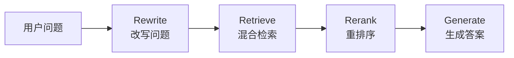

## Flash-RAG

Flash-RAG 是一个基于 **vLLM** 的高并发垂直领域智能问答引擎，当前主要聚焦于 **法律条文咨询助手** 场景。

---

## 项目结构

```text
Flash-RAG/
├── src/                   # 源代码目录
│   ├── core/              # 核心功能模块
│   │   ├── CustomVLLM.py  # 自定义 vLLM 集成
│   │   └── ingest.py      # 文档向量化处理
│   ├── api/               # API 服务
│   │   └── main.py       # FastAPI RAG 服务
│   ├── training/          # 训练相关
│   │   ├── train.py      # 模型训练脚本
│   │   └── merge.py      # 权重合并脚本
│   └── frontend/         # 前端相关
│       └── frontend.py
├── scripts/              # 脚本目录
│   ├── vllm.sh           # vLLM 服务启动脚本
│   ├── fastapi.sh        # FastAPI 服务启动脚本
│   ├── check_vllm.sh     # vLLM 服务检查脚本
│   └── frontend.sh       # 前端启动脚本
├── config/               # 配置文件目录
│   └── train_config.yaml # 训练与模型相关的全部参数
├── data/                 # 数据目录
│   ├── datasets/         # 训练/评测数据
│   │   └── train.jsonl
│   └── docs/             # 文档数据
│       └── legal_docs.txt
├── tests/                # 测试文件
│   └── test_client.py    # API 测试客户端
├── output/               # 训练输出与日志（自动生成，已加入 .gitignore）
├── chroma_db/            # 向量数据库（自动生成，已加入 .gitignore）
├── requirements.txt      # 项目依赖
├── .gitignore           # Git 忽略规则
└── README.md            # 项目说明文档
```

---

## 快速开始

### 1. 环境准备

```bash
# 克隆项目
git clone https://github.com/F0rJay/Flash-rag.git
cd Flash-rag

# 安装依赖
pip install -r requirements.txt
```

### 2. 准备数据

确保以下文件存在：
- `data/datasets/train.jsonl` - 训练数据（格式：每行一个 JSON，包含 `instruction`, `input`, `output` 字段）
- `data/docs/legal_docs.txt` - 知识库文档（用于 RAG）

### 3. 模型训练与部署

#### 步骤 1: 训练 LoRA 适配器

```bash
# 从项目根目录运行
python src/training/train.py
```

训练配置在 `config/train_config.yaml` 中，可根据需要调整：
- 模型路径
- 训练参数（学习率、批次大小等）
- LoRA 参数（rank、alpha 等）

#### 步骤 2: 合并权重（必须！）

```bash
python src/training/merge.py
```

合并后的模型将保存在 `output/llama3-law-merged/` 目录。

#### 步骤 3: 文档向量化（RAG 知识库构建）

```bash
python src/core/ingest.py
```

这将：
- 加载 `data/docs/legal_docs.txt`
- 切分文档为块
- 生成向量嵌入
- 存储到 `chroma_db/` 向量数据库

### 4. 启动服务

#### 启动 vLLM 推理服务（终端 1）

```bash
bash scripts/vllm.sh
```

服务将在 `http://localhost:8000` 启动。

**检查服务状态：**
```bash
bash scripts/check_vllm.sh
```

#### 启动 FastAPI RAG 服务（终端 2）

```bash
bash scripts/fastapi.sh
```

服务将在 `http://localhost:8080` 启动。

### 5. 测试 API

```bash
# 使用测试客户端
python tests/test_client.py

# 或使用 curl
curl -X POST http://localhost:8080/api/rag/chat \
  -H "Content-Type: application/json" \
  -d '{"query": "如果甲方逾期支付本金，需要承担什么违约责任？"}'
```

### 配置说明

所有配置都在 `config/train_config.yaml` 中，包括：
- 模型配置（模型名称、最大序列长度）
- 数据配置（训练数据路径）
- 训练参数（学习率、批次大小、训练轮数）
- LoRA 参数（rank、alpha、dropout）
- 量化配置（是否启用 4-bit 量化）

---

## 🚀 项目开发要点速查卡

### 核心目标

打造一个 **低延迟、高并发、懂垂直领域知识** 的生产级 AI 问答系统。

---

### Phase 1: 模型特训 (Training & Optimization)

**任务：** 让模型"懂行"且"轻量"。

**技术栈：** HuggingFace Transformers, PEFT, AutoGPTQ / BitsAndBytes

#### 关键概念

| 概念 | 说明 | 关键参数 |
|------|------|----------|
| **LoRA (Low-Rank Adaptation)** | 只训练旁路小矩阵，大幅减少训练成本 | `r` (Rank, 如 8 或 16)<br>`target_modules` (通常涵盖所有 Linear layers) |
| **Merge Weights (权重合并)** | ⚠️ **必做步骤！** 训练完必须将 LoRA 权重合并回底座模型 | 保存为独立的 `.safetensors` 格式 |
| **Quantization (量化)** | 推荐 AWQ 格式（比 GPTQ 对 vLLM 支持更好） | 将显存需求砍到 1/3 |

#### ⚠️ 避坑指南

> **重要：** 只有合并了权重，推理速度才会快。挂载 Adapter 推理反而会变慢。

**训练流程：**
```bash
# 1. 训练 LoRA 适配器
python src/training/train.py

# 2. 合并权重（必须！）
python src/training/merge.py

# 3. 量化（可选，但推荐）
# 使用 AutoGPTQ 或 AWQ 工具进行量化
# 量化后的模型路径需要在 vllm.sh 中指定
```

---

### Phase 2: 极速推理 (Inference Engine)

**任务：** 榨干 GPU 性能，解决显存瓶颈。

**技术栈：** vLLM

#### 核心机制

- **PagedAttention**: 显存分页管理，拒绝碎片化

#### 启动参数示例

使用项目提供的脚本（推荐）：
```bash
bash scripts/vllm.sh
```

脚本会自动：
- 检测模型路径（`output/llama3-law-merged`）
- 设置合适的显存使用率（0.85）
- 配置并发限制（max-num-seqs 128）

手动启动（如需自定义参数）：
```bash
vllm serve \
    output/llama3-law-merged \
    --host 0.0.0.0 \
    --port 8000 \
    --dtype bfloat16 \
    --quantization awq \          # 如果模型量化过，必须加
    --gpu-memory-utilization 0.85 \ # 显存预留比例，越大 KV Cache 越多
    --max-model-len 4096 \        # 强制截断，防止 OOM
    --max-num-seqs 128            # 限制并发序列数
```

#### 性能调优

| 指标 | 说明 | 平衡策略 |
|------|------|----------|
| **Throughput (吞吐量)** | 单位时间处理的请求数 | Batch size 越大，吞吐越高 |
| **Latency (延迟)** | 单个请求的响应时间 | 但延迟可能增加，需寻找平衡点 |

#### ⚠️ 避坑指南

> **常见错误：** 遇到 `Request ignored` 报错，通常是：
> - `max-model-len` 没设限制
> - 显存被 KV Cache 撑爆了
> - 需要降低 `gpu-memory-utilization` 或 `max-num-seqs`

---

### Phase 3: 后端架构 (Backend & RAG)

**任务：** 搭建不阻塞的 API，实现打字机效果。

**技术栈：** FastAPI, Uvicorn, LangChain / LlamaIndex

#### 核心模式

- **Async/Await**: 必须使用 `async def` 定义接口，调用数据库和模型时必须 `await`
- **SSE (Server-Sent Events)**: 流式输出的标准协议

#### RAG 黄金链路



1. **Rewrite**: 改写用户问题，提升检索准确率
2. **Retrieve**: 混合检索（Vector + Keyword）
3. **Rerank (重排序)**: 使用 BGE-Reranker 等小模型对检索结果精排（Top 50 → Top 5）
4. **Generate**: 拼接 Prompt 送入 vLLM

**当前实现：**

项目已实现基础的 RAG 流程（位于 `src/api/main.py`）：
- ✅ 向量检索（使用 ChromaDB）
- ✅ 上下文拼接
- ✅ vLLM 集成

**扩展方向：**
```python
# 在 src/api/main.py 中扩展
@app.post("/api/rag/chat")
async def chat_endpoint(request: ChatRequest):
    # 1. 改写问题（待实现）
    rewritten_query = await rewrite_query(request.query)
    
    # 2. 检索（已实现）
    docs = await retriever.retrieve(rewritten_query)
    
    # 3. 重排序（待实现）
    ranked_docs = await reranker.rerank(docs, top_k=5)
    
    # 4. 生成（已实现）
    response = await llm.generate(context=ranked_docs, query=request.query)
    
    return {"response": response}
```

---

### Phase 4: 生产交付 (Production & Ops)

**任务：** 证明系统稳健，用数据说话。

**技术栈：** Docker, Locust (压测), Prometheus + Grafana

#### 监控重点

| 指标 | 说明 | 阈值 |
|------|------|------|
| **gpu_cache_usage** | KV Cache 使用率 | 如果长期高于 95%，说明需要加卡或优化模型长度 |
| **request_latency** | 请求延迟 | P50 < 200ms, P99 < 1s |
| **throughput** | 吞吐量 | 根据业务需求设定 |

#### 部署检查清单

- [ ] 模型权重已合并（非 LoRA Adapter）
- [ ] vLLM 服务正常启动，无 OOM 错误
- [ ] FastAPI 接口支持异步和流式输出
- [ ] RAG 链路完整（Rewrite → Retrieve → Rerank → Generate）
- [ ] 监控指标已配置（GPU 使用率、延迟、吞吐量）
- [ ] 压测通过（使用 Locust 进行负载测试）

---

## 📚 相关资源

- [vLLM 官方文档](https://docs.vllm.ai/)
- [LangChain 文档](https://python.langchain.com/)
- [PEFT (LoRA) 文档](https://huggingface.co/docs/peft/)
- [HuggingFace Transformers](https://huggingface.co/docs/transformers/)

## 🔧 常见问题

### Q: 训练时出现显存不足？
A: 在 `config/train_config.yaml` 中：
- 启用 4-bit 量化：`load_in_4bit: true`
- 减小批次大小：`per_device_train_batch_size: 4`
- 增加梯度累积：`gradient_accumulation_steps: 2`

### Q: vLLM 启动失败，提示 OOM？
A: 在 `scripts/vllm.sh` 中：
- 降低 `--gpu-memory-utilization`（如 0.8）
- 减小 `--max-num-seqs`（如 64）
- 减小 `--max-model-len`（如 2048）

### Q: 如何添加新的文档到知识库？
A: 
1. 将文档添加到 `data/docs/` 目录
2. 运行 `python src/core/ingest.py` 重新构建向量库

### Q: 如何修改 API 端口？
A: 
- vLLM 服务：修改 `scripts/vllm.sh` 中的 `--port`
- FastAPI 服务：修改 `scripts/fastapi.sh` 中的 `--port`

## 📝 开发说明

### 代码结构说明

- `src/core/` - 核心功能模块，可独立使用
- `src/api/` - API 服务层，依赖 core 模块
- `src/training/` - 训练相关脚本，可独立运行
- `scripts/` - 启动脚本，支持相对路径，可在任意位置运行

### 扩展开发

1. **添加新的检索器**：在 `src/core/` 中创建新模块
2. **扩展 API 接口**：在 `src/api/main.py` 中添加路由
3. **自定义训练流程**：修改 `src/training/train.py`

---

**License**: 见 [LICENSE](LICENSE) 文件

