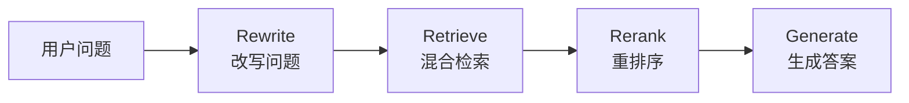

## Flash-RAG

Flash-RAG 是一个基于 **vLLM** 的高并发垂直领域智能问答引擎，当前主要聚焦于 **法律条文咨询助手** 场景。

---

## 项目结构

```text
Flash-RAG/
├── config/                # 配置文件目录
│   └── train_config.yaml  # 训练与模型相关的全部参数
├── datasets/                  # 训练/评测数据
│   └── train.jsonl
├── output/                # 训练输出与日志（自动生成）
├── train.py               # 训练脚本，只负责逻辑，不写死参数
└── requirements.txt       # 项目依赖
```

---

## 快速开始

1. 安装依赖：

```bash
pip install -r requirements.txt
```

2. 准备数据（确保 `data/train.jsonl` 存在且格式正确）。

3. 启动训练：

```bash
python train.py
```

根据需要修改 `config/train_config.yaml` 即可调整模型、数据和训练参数。

---

## 🚀 项目开发要点速查卡

### 核心目标

打造一个 **低延迟、高并发、懂垂直领域知识** 的生产级 AI 问答系统。

---

### Phase 1: 模型特训 (Training & Optimization)

**任务：** 让模型"懂行"且"轻量"。

**技术栈：** HuggingFace Transformers, PEFT, AutoGPTQ / BitsAndBytes

#### 关键概念

| 概念 | 说明 | 关键参数 |
|------|------|----------|
| **LoRA (Low-Rank Adaptation)** | 只训练旁路小矩阵，大幅减少训练成本 | `r` (Rank, 如 8 或 16)<br>`target_modules` (通常涵盖所有 Linear layers) |
| **Merge Weights (权重合并)** | ⚠️ **必做步骤！** 训练完必须将 LoRA 权重合并回底座模型 | 保存为独立的 `.safetensors` 格式 |
| **Quantization (量化)** | 推荐 AWQ 格式（比 GPTQ 对 vLLM 支持更好） | 将显存需求砍到 1/3 |

#### ⚠️ 避坑指南

> **重要：** 只有合并了权重，推理速度才会快。挂载 Adapter 推理反而会变慢。

**训练流程：**
```bash
# 1. 训练 LoRA 适配器
python train.py

# 2. 合并权重（必须！）
python merge.py

# 3. 量化（可选，但推荐）
# 使用 AutoGPTQ 或 AWQ 工具进行量化
```

---

### Phase 2: 极速推理 (Inference Engine)

**任务：** 榨干 GPU 性能，解决显存瓶颈。

**技术栈：** vLLM

#### 核心机制

- **PagedAttention**: 显存分页管理，拒绝碎片化

#### 启动参数示例

```bash
vllm serve \
    /path/to/merged_model \
    --host 0.0.0.0 \
    --port 8000 \
    --dtype bfloat16 \
    --quantization awq \          # 如果模型量化过，必须加
    --gpu-memory-utilization 0.85 \ # 显存预留比例，越大 KV Cache 越多
    --max-model-len 4096 \        # 强制截断，防止 OOM
    --max-num-seqs 128            # 限制并发序列数
```

#### 性能调优

| 指标 | 说明 | 平衡策略 |
|------|------|----------|
| **Throughput (吞吐量)** | 单位时间处理的请求数 | Batch size 越大，吞吐越高 |
| **Latency (延迟)** | 单个请求的响应时间 | 但延迟可能增加，需寻找平衡点 |

#### ⚠️ 避坑指南

> **常见错误：** 遇到 `Request ignored` 报错，通常是：
> - `max-model-len` 没设限制
> - 显存被 KV Cache 撑爆了
> - 需要降低 `gpu-memory-utilization` 或 `max-num-seqs`

---

### Phase 3: 后端架构 (Backend & RAG)

**任务：** 搭建不阻塞的 API，实现打字机效果。

**技术栈：** FastAPI, Uvicorn, LangChain / LlamaIndex

#### 核心模式

- **Async/Await**: 必须使用 `async def` 定义接口，调用数据库和模型时必须 `await`
- **SSE (Server-Sent Events)**: 流式输出的标准协议

#### RAG 黄金链路



1. **Rewrite**: 改写用户问题，提升检索准确率
2. **Retrieve**: 混合检索（Vector + Keyword）
3. **Rerank (重排序)**: 使用 BGE-Reranker 等小模型对检索结果精排（Top 50 → Top 5）
4. **Generate**: 拼接 Prompt 送入 vLLM

**示例代码结构：**
```python
# FastAPI 异步接口示例
@app.post("/api/rag/chat")
async def chat_endpoint(request: ChatRequest):
    # 1. 改写问题
    rewritten_query = await rewrite_query(request.query)
    
    # 2. 检索
    docs = await retriever.retrieve(rewritten_query)
    
    # 3. 重排序
    ranked_docs = await reranker.rerank(docs, top_k=5)
    
    # 4. 生成
    response = await llm.generate(context=ranked_docs, query=request.query)
    
    return {"response": response}
```

---

### Phase 4: 生产交付 (Production & Ops)

**任务：** 证明系统稳健，用数据说话。

**技术栈：** Docker, Locust (压测), Prometheus + Grafana

#### 监控重点

| 指标 | 说明 | 阈值 |
|------|------|------|
| **gpu_cache_usage** | KV Cache 使用率 | 如果长期高于 95%，说明需要加卡或优化模型长度 |
| **request_latency** | 请求延迟 | P50 < 200ms, P99 < 1s |
| **throughput** | 吞吐量 | 根据业务需求设定 |

#### 部署检查清单

- [ ] 模型权重已合并（非 LoRA Adapter）
- [ ] vLLM 服务正常启动，无 OOM 错误
- [ ] FastAPI 接口支持异步和流式输出
- [ ] RAG 链路完整（Rewrite → Retrieve → Rerank → Generate）
- [ ] 监控指标已配置（GPU 使用率、延迟、吞吐量）
- [ ] 压测通过（使用 Locust 进行负载测试）

---

## 📚 相关资源

- [vLLM 官方文档](https://docs.vllm.ai/)
- [LangChain 文档](https://python.langchain.com/)
- [PEFT (LoRA) 文档](https://huggingface.co/docs/peft/)

