## LegalFlash-RAG

LegalFlash-RAG 是一个基于 **vLLM** 的高并发垂直领域智能问答引擎，专为法律领域设计，提供从模型训练、推理部署到 RAG 检索的完整解决方案。

### ✨ 核心特性

- 🚀 **高性能推理**: 基于 vLLM 的 PagedAttention 技术，支持高并发低延迟推理
- 📚 **多知识库 RAG**: 支持法条型、案例型、判决书型三种知识库，自动混合检索
- 🎯 **领域特化**: 针对法律垂直领域进行 LoRA 微调，模型更懂法律知识
- 🔄 **Query Rewrite**: 智能改写用户问题为专业检索关键词，提升检索准确率
- 🎯 **Rerank 重排序**: 使用 Cross-Encoder 模型精细排序，Top 50 → Top 5，显著提升精度
- ⚡ **流式输出**: SSE 流式响应，打字机效果，首字延迟（TTFT）降低到毫秒级
- 📄 **引用展示**: 显示 RAG 检索到的文档来源，增强答案可信度
- 📊 **训练可视化**: 集成 TensorBoard 和 GPU 监控，实时追踪训练过程
- 🔍 **模型评估**: 支持 BLEU、ROUGE、困惑度等多种评估指标
- ⚡ **异步架构**: FastAPI + 异步处理，支持高并发请求
- 🛠️ **开箱即用**: 提供完整的脚本和配置，快速上手

### 🎯 适用场景

- **法律咨询助手**: 回答法律条文相关问题
- **案例分析**: 提供相似案例和判决参考
- **法律知识检索**: 快速检索相关法律条文和判决书
- **垂直领域问答**: 可扩展到其他专业领域（医疗、金融等）

### 🏗️ 技术架构

```
用户问题 → FastAPI → LangChain (RAG 检索) → vLLM (模型推理) → 返回答案
                ↓
        多知识库混合检索 (ChromaDB)
    (法条型 + 案例型 + 判决书型)
```

**核心组件：**
- **FastAPI**: 异步 Web 框架，处理 HTTP 请求
- **LangChain**: RAG 框架，负责向量检索、文档处理、LLM 集成
- **ChromaDB**: 向量数据库，存储和检索文档向量
- **vLLM**: 高性能推理引擎，生成最终答案

### 📦 技术栈

- **训练框架**: HuggingFace Transformers, PEFT (LoRA), TRL, BitsAndBytes
- **推理引擎**: vLLM (PagedAttention)
- **后端框架**: FastAPI, Uvicorn
- **RAG 框架**: LangChain (向量检索、文档处理、LLM 集成)
- **向量数据库**: ChromaDB
- **Embedding**: HuggingFace Embeddings
- **监控可视化**: TensorBoard, GPU 监控

### 🎓 项目亮点

1. **端到端解决方案**: 从数据准备、模型训练到服务部署的完整流程
2. **生产级优化**: GPU 监控、模型评估、训练可视化等生产必备功能
3. **灵活的知识库**: 支持多种知识库类型，可根据需求灵活组合
4. **详细文档**: 提供完整的开发指南和常见问题解答

---

## 项目结构

```text
LegalFlash-RAG/
├── src/                   # 源代码目录
│   ├── core/              # 核心功能模块
│   │   ├── CustomVLLM.py  # 自定义 vLLM 集成
│   │   └── ingest.py      # 文档向量化处理
│   ├── api/               # API 服务
│   │   └── main.py       # FastAPI RAG 服务
│   ├── training/          # 训练相关
│   │   ├── train.py      # 模型训练脚本
│   │   ├── evaluate.py   # 模型评估脚本
│   │   └── merge.py      # 权重合并脚本
│   └── frontend/         # 前端相关
│       └── frontend.py
├── scripts/              # 脚本目录
│   ├── vllm.sh           # vLLM 服务启动脚本
│   ├── fastapi.sh        # FastAPI 服务启动脚本
│   ├── check_vllm.sh     # vLLM 服务检查脚本
│   ├── frontend.sh       # 前端启动脚本
│   ├── view_training.sh  # TensorBoard 可视化启动脚本
│   ├── prepare_dataset.py        # 数据集准备脚本（转换和划分）
│   ├── prepare_rag_knowledge.py   # RAG 知识库准备脚本（提取法律条文）
│   └── analyze_dataset.py        # 数据集分析和验证脚本
├── config/               # 配置文件目录
│   └── train_config.yaml # 训练与模型相关的全部参数
├── data/                 # 数据目录
│   ├── datasets/         # 训练/评测数据
│   │   ├── train.jsonl   # 训练集
│   │   ├── val.jsonl     # 验证集
│   │   └── test.jsonl    # 测试集
│   └── docs/             # 文档数据（RAG 知识库）
│       ├── legal_docs.txt      # 法条型知识库（法律条文）
│       ├── case_docs.txt       # 案例型知识库（案件+判决）
│       └── judgement_docs.txt  # 判决书型知识库（完整判决书）
├── tests/                # 测试文件
│   └── test_client.py    # API 测试客户端
├── output/               # 训练输出与日志（自动生成，已加入 .gitignore）
├── chroma_db/            # 法条型向量数据库（自动生成，已加入 .gitignore）
├── chroma_db_case/       # 案例型向量数据库（自动生成，已加入 .gitignore）
├── chroma_db_judgement/  # 判决书型向量数据库（自动生成，已加入 .gitignore）
├── requirements.txt      # 项目依赖
├── .gitignore           # Git 忽略规则
└── README.md            # 项目说明文档
```

---

## 快速开始

> 📖 **完整使用手册**：如果你是第一次使用本项目，强烈建议先阅读 [完整使用手册](docs/USER_GUIDE.md)，里面包含从模型训练到 Docker 部署的详细步骤说明。

### 🚀 快速开始

### 1. 环境准备

```bash
# 克隆项目
git clone https://github.com/F0rJay/LegalFlash-RAG.git
cd LegalFlash-RAG

# 安装依赖
pip install -r requirements.txt
```

### 2. 准备数据

#### 2.1 训练数据准备

项目需要的数据格式为 JSONL，每行一个 JSON 对象，包含以下字段：
```json
{
  "instruction": "问题或指令",
  "input": "上下文或输入（可为空字符串）",
  "output": "期望的回答"
}
```

**如果你有 DISC-Law 格式的数据**（格式：`{"id": "...", "input": "...", "output": "..."}`），可以使用项目提供的脚本自动转换和划分：

```bash
# 转换 DISC-Law 格式并划分数据集
python scripts/prepare_dataset.py /path/to/DISC-Law-SFT-Pair-QA-released.jsonl \
    --train-ratio 0.8 \
    --val-ratio 0.1 \
    --test-ratio 0.1
```

脚本会自动：
- 将 DISC-Law 格式转换为项目格式（`input` → `instruction`）
- 按比例划分数据集（默认：训练集 80%，验证集 10%，测试集 10%）
- 保存到 `data/datasets/` 目录：
  - `train.jsonl` - 训练集
  - `val.jsonl` - 验证集
  - `test.jsonl` - 测试集

**如果你已有符合格式的数据**，直接放到 `data/datasets/` 目录即可：
- `train.jsonl` - 训练集
- `val.jsonl` - 验证集（可选，用于训练过程中的评估）
- `test.jsonl` - 测试集（可选，用于最终评估）

**验证已有数据集格式：**
```bash
# 验证数据集格式是否正确
python scripts/prepare_dataset.py --validate

# 或使用分析脚本获取详细统计
python scripts/analyze_dataset.py
```

**使用已有数据集（不进行转换）：**
```bash
# 如果已有 train/val/test.jsonl，直接使用
python scripts/prepare_dataset.py --use-existing
```

#### 2.2 RAG 知识库文档

**方法 1: 使用 DISC-Law 数据集（推荐）**

项目支持从 DISC-Law JSONL 文件构建两种类型的知识库：

**法条型知识库（法律条文）：**
```bash
# 提取法律条文（从 reference 字段）
python scripts/prepare_rag_knowledge.py \
    /path/to/DISC-Law-SFT-Triplet-QA-released.jsonl \
    --mode law \
    --output data/docs/legal_docs.txt
```

**案例型知识库（案件+判决）：**
```bash
# 提取案例（从 input + output 字段）
python scripts/prepare_rag_knowledge.py \
    /path/to/DISC-Law-SFT-Triplet-released.jsonl \
    --mode case \
    --output data/docs/case_docs.txt
```

**判决书型知识库（完整判决书）：**
```bash
# 提取判决书（从 input 字段，包含完整判决书原文）
python scripts/prepare_rag_knowledge.py \
    /path/to/DISC-Law-SFT-Pair.jsonl \
    --mode judgement \
    --output data/docs/judgement_docs.txt
```

**混合模式（同时提取法条和案例）：**
```bash
python scripts/prepare_rag_knowledge.py \
    file1.jsonl file2.jsonl \
    --mode mixed \
    --output data/docs/mixed_docs.txt
```

脚本功能：
- `--mode law`: 提取 `reference` 字段中的法律条文
- `--mode case`: 提取 `input`（案件事实）+ `output`（判决结果）
- `--mode judgement`: 提取 `input`（完整判决书原文，包含案件事实、判决结果、法律条文等）
- `--mode mixed`: 同时提取法条和案例
- 自动去重并合并多个文件

**方法 2: 手动准备**

直接准备文本文件：
- `data/docs/legal_docs.txt` - 法律条文（每行或每段一个条文）
- `data/docs/case_docs.txt` - 案例文档（案件事实+判决结果）
- `data/docs/judgement_docs.txt` - 判决书文档（完整判决书原文）

### 3. 模型训练与部署

#### 步骤 1: 训练 LoRA 适配器

```bash
# 从项目根目录运行
python src/training/train.py
```

训练配置在 `config/train_config.yaml` 中，可根据需要调整：
- 模型路径
- 数据路径（训练集、验证集、测试集）
- 训练参数（学习率、批次大小、训练轮数）
- 评估设置（评估频率、保存最佳模型等）
- LoRA 参数（rank、alpha 等）

**GPU 监控：**

训练过程中会自动监控 GPU 状态：
- 💾 显存使用（已分配/预留/总显存）
- ⚡ GPU 使用率
- 🌡️  温度监控
- 🔋 功耗监控

监控数据会：
- 定期打印到控制台（每 10 步）
- 实时记录到 TensorBoard

**训练可视化（TensorBoard）：**

训练过程中会自动记录训练指标到 TensorBoard：
```bash
# 启动 TensorBoard（在另一个终端）
bash scripts/view_training.sh

# 或手动启动
tensorboard --logdir output/logs --port 6006
```

然后在浏览器中访问 `http://localhost:6006` 查看：
- 📈 训练损失曲线
- 📊 验证损失曲线
- 📉 学习率变化
- ⏱️  训练速度（samples/sec）
- 🖥️  GPU 指标（显存、使用率、温度、功耗）

**验证集评估：**

训练脚本会自动使用验证集进行评估（如果配置了 `val_path`）：
- 每 `eval_steps` 步评估一次
- 自动保存最佳模型（基于 `eval_loss`）
- 训练日志中包含验证集指标
- 训练统计信息保存在 `output/training_stats.json`

**查看训练日志：**
```bash
# 训练日志保存在 output/ 目录
ls output/

# 查看训练统计
cat output/training_stats.json
```

#### 步骤 2: 合并权重（必须！）

```bash
python src/training/merge.py
```

合并后的模型将保存在 `output/llama3-law-merged/` 目录。

#### 步骤 3: 文档向量化（RAG 知识库构建）

项目支持两种类型的 RAG 知识库：

**3.1 法条型知识库（法律条文）**

```bash
# 从 DISC-Law JSONL 文件提取法律条文
python scripts/prepare_rag_knowledge.py \
    /path/to/DISC-Law-SFT-Triplet-QA-released.jsonl \
    --mode law \
    --output data/docs/legal_docs.txt

# 构建法条型向量数据库
python src/core/ingest.py \
    --docs-path data/docs/legal_docs.txt \
    --knowledge-type law \
    --chunk-size 500 \
    --chunk-overlap 50
```

**3.2 案例型知识库（案件+判决）**

```bash
# 从 DISC-Law JSONL 文件提取案例
python scripts/prepare_rag_knowledge.py \
    /path/to/DISC-Law-SFT-Triplet-released.jsonl \
    --mode case \
    --output data/docs/case_docs.txt

# 构建案例型向量数据库
python src/core/ingest.py \
    --docs-path data/docs/case_docs.txt \
    --knowledge-type case \
    --chunk-size 1000 \
    --chunk-overlap 100
```

**3.3 判决书型知识库（完整判决书）**

```bash
# 从 DISC-Law JSONL 文件提取判决书
python scripts/prepare_rag_knowledge.py \
    /path/to/DISC-Law-SFT-Pair.jsonl \
    --mode judgement \
    --output data/docs/judgement_docs.txt

# 构建判决书型向量数据库（使用更大的 chunk_size 保持判决书完整性）
python src/core/ingest.py \
    --docs-path data/docs/judgement_docs.txt \
    --knowledge-type judgement \
    --chunk-size 1500 \
    --chunk-overlap 150
```

**3.4 混合模式（推荐）**

同时构建多种知识库，API 会自动启用混合检索：
- 法条型：提供法律依据
- 案例型：提供相似案例参考
- 判决书型：提供完整判决书参考

```bash
# 1. 准备法条型知识库
python scripts/prepare_rag_knowledge.py file1.jsonl --mode law
python src/core/ingest.py --knowledge-type law

# 2. 准备案例型知识库
python scripts/prepare_rag_knowledge.py file2.jsonl --mode case
python src/core/ingest.py --knowledge-type case

# 3. 准备判决书型知识库
python scripts/prepare_rag_knowledge.py file3.jsonl --mode judgement
python src/core/ingest.py --knowledge-type judgement

# 4. 启动服务（自动启用混合检索）
bash scripts/fastapi.sh
```

**知识库说明：**
- 法条型：存储位置 `chroma_db/`，包含法律条文原文
- 案例型：存储位置 `chroma_db_case/`，包含案件事实和判决结果
- 判决书型：存储位置 `chroma_db_judgement/`，包含完整判决书（案件事实+判决结果+法律条文）
- 混合检索：同时从多个知识库检索，结合法条、案例和判决书给出更全面的回答

**验证集评估：**

训练脚本会自动使用验证集进行评估（如果配置了 `val_path`）：
- 每 `eval_steps` 步评估一次
- 自动保存最佳模型（基于 `eval_loss`）
- 训练日志中包含验证集指标

**查看训练日志：**
```bash
# 训练日志保存在 output/ 目录
ls output/
```

### 5. 启动服务

#### 方式 1: Docker Compose 部署（推荐，生产环境）

**前置要求：**
- Docker 和 Docker Compose 已安装
- NVIDIA Docker 支持（GPU 推理需要）

**在 Autodl 实例中部署：**

Autodl 实例支持 Docker，但可能需要先安装。详细安装步骤请参考 `docs/DOCKER_DEPLOYMENT.md`。

```bash
# 启动所有服务（一键启动）
bash scripts/docker-start.sh

# 或手动启动
docker-compose up -d

# 查看服务状态
docker-compose ps

# 查看日志
docker-compose logs -f

# 停止服务
bash scripts/docker-stop.sh
# 或
docker-compose down
```

**服务地址：**
- vLLM API: `http://localhost:8000`
- FastAPI: `http://localhost:8080`
- Streamlit: `http://localhost:8501`

**优势：**
- ✅ 微服务架构，服务隔离
- ✅ 一键启动，无需手动管理多个进程
- ✅ 自动健康检查和重启
- ✅ 资源隔离和限制
- ✅ 易于扩展和部署

#### 方式 2: 手动启动（开发环境）

**启动 vLLM 推理服务（终端 1）：**

```bash
bash scripts/vllm.sh
```

服务将在 `http://localhost:8000` 启动。

**检查服务状态：**
```bash
bash scripts/check_vllm.sh
```

**启动 FastAPI RAG 服务（终端 2）：**

```bash
bash scripts/fastapi.sh
```

服务将在 `http://localhost:8080` 启动。

**API 端点：**
- `POST /api/rag/chat`: RAG 问答接口（支持流式输出）
  - 参数：
    - `query`: 用户问题（必需）
    - `temperature`: 温度参数（默认 0.1）
    - `max_tokens`: 最大 token 数（默认 1024）
    - `stream`: 是否启用流式输出（默认 false）
  - 流式响应：使用 SSE (Server-Sent Events) 格式
- `GET /health`: 健康检查

#### 启动前端界面（可选，终端 3）

```bash
bash scripts/frontend.sh
# 或手动启动
streamlit run src/frontend/frontend.py --server.port 8501
```

前端将在 `http://localhost:8501` 启动。

**前端功能：**
- ⚡ **流式输出**: 答案逐字显示，打字机效果，首字延迟（TTFT）降低到毫秒级
- 📄 **引用展示**: 显示 RAG 检索到的文档来源，增强答案可信度
- ⚙️ **参数调节**: 侧边栏可调整 Temperature 和 Max Tokens
- 💬 **对话历史**: 保存对话记录

### 6. 测试 API

```bash
# 使用测试客户端
python tests/test_client.py

# 或使用 curl（非流式）
curl -X POST http://localhost:8080/api/rag/chat \
  -H "Content-Type: application/json" \
  -d '{"query": "如果甲方逾期支付本金，需要承担什么违约责任？"}'

# 流式输出测试
curl -X POST http://localhost:8080/api/rag/chat \
  -H "Content-Type: application/json" \
  -d '{"query": "如果甲方逾期支付本金，需要承担什么违约责任？", "stream": true}' \
  --no-buffer
```

### 配置说明

所有配置都在 `config/train_config.yaml` 中，包括：
- 模型配置（模型名称、最大序列长度）
- 数据配置（训练数据路径）
- 训练参数（学习率、批次大小、训练轮数）
- LoRA 参数（rank、alpha、dropout）
- 量化配置（是否启用 4-bit 量化）

---

## 🚀 项目开发要点速查卡

### 核心目标

打造一个 **低延迟、高并发、懂垂直领域知识** 的生产级 AI 问答系统。

---

### Phase 1: 模型特训 (Training & Optimization)

**任务：** 让模型"懂行"且"轻量"，适配法律垂直领域。

**技术栈：** HuggingFace Transformers, PEFT, BitsAndBytes, TRL, TensorBoard

#### 关键概念

| 概念 | 说明 | 项目配置 |
|------|------|----------|
| **LoRA (Low-Rank Adaptation)** | 只训练旁路小矩阵，大幅减少训练成本 | `r=64`, `lora_alpha=128`<br>`target_modules`: 全量线性层（7个模块） |
| **4-bit 量化训练** | 使用 BitsAndBytes 在训练时量化，降低显存占用 | `load_in_4bit: true`<br>支持 RTX 5090 大 batch size |
| **验证集评估** | 训练过程中自动评估，保存最佳模型 | `evaluation_strategy: "steps"`<br>`eval_steps: 100` |
| **TensorBoard 可视化** | 实时监控训练损失、验证损失、学习率 | `report_to: "tensorboard"`<br>`logging_dir: "./output/logs"` |
| **GPU 监控** | 监控显存、使用率、温度、功耗 | `gpu_monitor.enabled: true`<br>自动记录到 TensorBoard |
| **Merge Weights (权重合并)** | ⚠️ **必做步骤！** 训练完必须将 LoRA 权重合并回底座模型 | 保存为完整模型，vLLM 可直接加载 |

#### 训练流程

**1. 准备数据集：**
```bash
# 转换和划分数据集
python scripts/prepare_dataset.py \
    --input DISC-Law-SFT-Pair-QA-released.jsonl \
    --output-dir data/datasets

# 分析数据集质量
python scripts/analyze_dataset.py
```

**2. 配置训练参数：**
编辑 `config/train_config.yaml`：
- 模型路径、数据路径
- LoRA 参数（r, alpha, dropout）
- 训练参数（batch_size, learning_rate, epochs）
- 评估设置（eval_steps, load_best_model_at_end）
- GPU 监控设置

**3. 开始训练：**
```bash
# 启动训练（自动启用 TensorBoard 和 GPU 监控）
python src/training/train.py

# 在另一个终端查看训练可视化
bash scripts/view_training.sh
# 访问 http://localhost:6006
```

**4. 模型评估：**
```bash
# 评估 LoRA 适配器（BLEU、ROUGE、困惑度）
python src/training/evaluate.py \
    --model_path output/llama3-law-assistant-lora
```

**5. 合并权重（必须！）：**
```bash
# 合并 LoRA 权重到基础模型
python src/training/merge.py
# 合并后的模型保存在 output/llama3-law-merged/

# 评估合并后的模型
python src/training/evaluate.py \
    --model_path output/llama3-law-merged
```

#### ⚠️ 避坑指南

> **重要：** 
> - 只有合并了权重，推理速度才会快。挂载 Adapter 推理反而会变慢。
> - 训练时使用 4-bit 量化可大幅降低显存占用，但合并后的模型是完整精度。
> - 验证集评估会自动保存最佳模型，避免过拟合。
> - GPU 监控可帮助发现显存瓶颈和性能问题。

---

### Phase 2: 极速推理 (Inference Engine)

**任务：** 榨干 GPU 性能，实现高并发低延迟推理。

**技术栈：** vLLM (PagedAttention)

#### 核心机制

- **PagedAttention**: 显存分页管理，拒绝碎片化，支持高并发
- **Continuous Batching**: 动态批处理，自动管理请求队列
- **KV Cache 优化**: 智能管理 KV Cache，平衡显存和性能

#### 启动方式

**使用项目脚本（推荐）：**
```bash
bash scripts/vllm.sh
```

脚本配置（`scripts/vllm.sh`）：
- 模型路径：`output/llama3-law-merged`
- 数据类型：`bfloat16`（RTX 5090 推荐）
- 显存使用率：`0.85`（预留 15% 给系统）
- 最大序列长度：`4096`（防止 OOM）
- 最大并发序列：`128`（控制 KV Cache 占用）
- 服务端口：`8000`

**手动启动（自定义参数）：**
```bash
vllm serve \
    output/llama3-law-merged \
    --host 0.0.0.0 \
    --port 8000 \
    --dtype bfloat16 \
    --gpu-memory-utilization 0.85 \
    --max-model-len 4096 \
    --max-num-seqs 128
```

**检查服务状态：**
```bash
bash scripts/check_vllm.sh
# 或手动检查
curl http://localhost:8000/health
```

#### 性能调优

| 参数 | 说明 | 项目配置 | 调优建议 |
|------|------|----------|----------|
| **gpu-memory-utilization** | 显存使用率 | `0.85` | 越高 KV Cache 越多，但可能 OOM |
| **max-model-len** | 最大序列长度 | `4096` | 根据模型和显存调整 |
| **max-num-seqs** | 最大并发序列数 | `128` | 控制 KV Cache 占用，影响吞吐量 |
| **dtype** | 数据类型 | `bfloat16` | RTX 5090 推荐 bfloat16 |

**性能指标：**
- **Throughput (吞吐量)**: 单位时间处理的 tokens 数
- **Latency (延迟)**: 单个请求的响应时间（P50, P99）
- **GPU 利用率**: 监控 GPU 使用率，避免空闲

#### ⚠️ 避坑指南

> **常见错误：**
> - `Request ignored`: 通常是 `max-num-seqs` 已满或显存不足
> - `CUDA OOM`: 降低 `gpu-memory-utilization` 或 `max-num-seqs`
> - `max-model-len` 过小：导致长文本被截断，需要增大（但会增加显存）
> - 服务启动慢：首次启动需要加载模型，耐心等待

> **优化建议：**
> - 如果显存充足，可适当提高 `gpu-memory-utilization` 到 0.9
> - 如果并发需求高，可增大 `max-num-seqs`（但要注意显存）
> - 使用 `bfloat16` 而非 `float16`，数值稳定性更好

---

### Phase 3: 后端架构 (Backend & RAG)

**任务：** 搭建异步 RAG API，支持多知识库混合检索。

**技术栈：** FastAPI, Uvicorn, LangChain, ChromaDB, HuggingFaceEmbeddings

#### 核心模式

- **Async/Await**: 所有接口使用 `async def`，数据库和模型调用必须 `await`
- **多知识库支持**: 支持法条型、案例型、判决书型三种知识库
- **混合检索**: 自动组合多个知识库的检索结果

#### RAG 知识库构建

**1. 准备知识库数据：**
```bash
# 法条型知识库（从 reference 字段提取）
python scripts/prepare_rag_knowledge.py \
    DISC-Law-SFT-Triplet-QA-released.jsonl \
    --mode law \
    --output data/docs/legal_docs.txt

# 案例型知识库（从 input 和 output 提取）
python scripts/prepare_rag_knowledge.py \
    DISC-Law-SFT-Triplet-QA-released.jsonl \
    --mode case \
    --output data/docs/case_docs.txt

# 判决书型知识库（从 pair 数据集提取）
python scripts/prepare_rag_knowledge.py \
    DISC-Law-SFT-Pair.jsonl \
    --mode judgement \
    --output data/docs/judgement_docs.txt
```

**2. 构建向量数据库：**
```bash
# 构建法条型知识库
python src/core/ingest.py \
    --docs-path data/docs/legal_docs.txt \
    --knowledge-type law \
    --chunk-size 500 \
    --chunk-overlap 50

# 构建案例型知识库
python src/core/ingest.py \
    --docs-path data/docs/case_docs.txt \
    --knowledge-type case \
    --chunk-size 800 \
    --chunk-overlap 80

# 构建判决书型知识库
python src/core/ingest.py \
    --docs-path data/docs/judgement_docs.txt \
    --knowledge-type judgement \
    --chunk-size 1500 \
    --chunk-overlap 150
```

#### RAG 检索流程

**完整实现（`src/api/main.py`）：**

```mermaid
graph LR
    A[用户问题] --> B[Query Rewrite<br/>查询改写]
    B --> C[向量检索<br/>Top 50]
    C --> D[法条型]
    C --> E[案例型]
    C --> F[判决书型]
    D --> G[Rerank<br/>重排序]
    E --> G
    F --> G
    G --> H[Top 5 文档]
    H --> I[构建 Prompt]
    I --> J[vLLM 生成]
```



**完整 RAG 链路：**

1. **Query Rewrite (查询改写)**: ✅ 已实现
   - 将用户口语化问题改写为专业法律检索关键词
   - 例如："他不还钱咋办？" → "债务违约 违约责任 还款义务"
   - 使用 LLM 进行智能改写，提升检索准确率

2. **Retrieve (向量检索)**: ✅ 已实现
   - 多知识库混合检索（法条型 + 案例型 + 判决书型）
   - 每个知识库先检索 Top 50 文档
   - 使用 ChromaDB 向量数据库进行语义检索

3. **Rerank (重排序)**: ✅ 已实现
   - 使用 Cross-Encoder 模型（BGE-Reranker）对 Top 50 文档进行精细打分
   - 从 Top 50 中选出最相关的 Top 5 文档
   - 显著提升检索精度，特别是在法律术语匹配方面

4. **Generate (生成答案)**: ✅ 已实现
   - 将 Top 5 文档作为上下文
   - 使用 vLLM 生成最终答案

**特性：**
- ✅ **Query Rewrite**: 智能改写用户问题，提升检索准确率
- ✅ **Rerank 重排序**: 使用 Cross-Encoder 精细排序，Top 50 → Top 5
- ✅ **自动多知识库加载**: 根据存在的向量库自动启用
- ✅ **混合检索**: 同时从多个知识库检索，合并结果
- ✅ **智能上下文拼接**: 根据知识库类型调整 chunk 大小
- ✅ **异步处理**: 所有操作使用 async/await，不阻塞

**知识库配置：**
| 知识库类型 | 向量库路径 | 检索数量 | 适用场景 |
|-----------|-----------|---------|---------|
| 法条型 | `chroma_db/` | k=2 | 法律条文查询 |
| 案例型 | `chroma_db_case/` | k=2 | 案例分析 |
| 判决书型 | `chroma_db_judgement/` | k=1 | 完整判决书参考 |

#### API 服务启动

```bash
# 启动 FastAPI 服务
bash scripts/fastapi.sh
# 或手动启动
uvicorn src.api.main:app --host 0.0.0.0 --port 8001
```

**API 端点：**
- `POST /api/rag/chat`: RAG 问答接口
- `GET /health`: 健康检查

#### 已实现功能

**核心 RAG 功能：**
1. ✅ **Query Rewrite**: 改写用户问题，提升检索准确率（`src/core/query_rewriter.py`）
2. ✅ **Rerank**: 使用 BGE-Reranker 对检索结果重排序（Top 50 → Top 5）（`src/core/reranker.py`）
3. ✅ **多知识库混合检索**: 自动组合法条型、案例型、判决书型知识库
4. ✅ **完整 RAG 链路**: Query Rewrite → Retrieve → Rerank → Generate

**已实现功能：**
1. ✅ **流式输出**: 实现 SSE 流式响应，打字机效果（`src/api/main.py`）
2. ✅ **引用展示**: 前端显示 RAG 检索到的文档来源，增强可信度
3. ✅ **参数调节**: 前端侧边栏支持调整 Temperature 和 Max Tokens

**扩展方向：**
1. **多轮对话**: 支持对话历史上下文
2. **查询缓存**: 缓存常见查询结果，提升响应速度
3. **检索策略优化**: 根据问题类型动态调整检索策略
4. **用户反馈**: 收集用户对答案的反馈，持续优化

**代码结构：**
```python
# src/api/main.py 中的完整流程
@app.post("/api/rag/chat")
async def chat_endpoint(request: ChatRequest):
    # 1. Query Rewrite（已实现）
    search_query = query_rewriter.rewrite(request.query)
    
    # 2. 多知识库检索（已实现）
    docs = mixed_retrieve(search_query, top_k=50)
    
    # 3. Rerank 重排序（已实现）
    ranked_docs = reranker.rerank_with_metadata(request.query, docs, top_k=5)
    
    # 4. 生成答案（已实现）
    response = llm.generate(context=ranked_docs, query=request.query)
    
    return {"response": response}
```

---

### Phase 4: 生产交付 (Production & Ops)

**任务：** 工程化封装，微服务架构部署。

**技术栈：** Docker, Docker Compose, 微服务架构

#### 微服务架构

项目采用标准的微服务架构，通过 Docker Compose 编排为两个核心服务：

**1. vLLM 服务 (vllm-service)**
- 专门负责模型推理计算
- 提供 OpenAI 兼容的 API 接口
- 独立 GPU 资源管理
- 端口：8000

**2. App 服务 (app-service)**
- FastAPI：RAG 业务逻辑（Query Rewrite → Retrieve → Rerank → Generate）
- Streamlit：前端界面
- 端口：8080 (FastAPI), 8501 (Streamlit)

#### Docker 部署

**前置要求：**
- Docker 和 Docker Compose 已安装
- NVIDIA Docker 支持（GPU 推理需要）
- 模型已训练并合并（`output/llama3-law-merged`）

**在 Autodl 实例中部署：**

Autodl 实例支持 Docker，但可能需要先安装：

```bash
# 1. 安装 Docker（如果未安装）
curl -fsSL https://get.docker.com | sh
sudo usermod -aG docker $USER

# 2. 安装 NVIDIA Docker（GPU 支持）
distribution=$(. /etc/os-release;echo $ID$VERSION_ID)
curl -s -L https://nvidia.github.io/nvidia-docker/gpgkey | sudo apt-key add -
curl -s -L https://nvidia.github.io/nvidia-docker/$distribution/nvidia-docker.list | \
    sudo tee /etc/apt/sources.list.d/nvidia-docker.list
sudo apt-get update
sudo apt-get install -y nvidia-docker2
sudo systemctl restart docker

# 3. 验证 GPU 支持
docker run --rm --gpus all nvidia/cuda:12.1.0-base-ubuntu22.04 nvidia-smi
```

**启动服务：**

```bash
# 使用启动脚本（推荐）
bash scripts/docker-start.sh

# 或手动启动
docker-compose up -d

# 查看日志
docker-compose logs -f

# 停止服务
bash scripts/docker-stop.sh
# 或
docker-compose down
```

**服务地址：**
- vLLM API: `http://localhost:8000`
- FastAPI: `http://localhost:8080`
- Streamlit: `http://localhost:8501`

**自定义配置：**

复制 `docker-compose.override.yml.example` 为 `docker-compose.override.yml` 来自定义配置：
- 端口映射
- 环境变量
- 资源限制

#### 监控重点

| 指标 | 说明 | 阈值 |
|------|------|------|
| **gpu_cache_usage** | KV Cache 使用率 | 如果长期高于 95%，说明需要加卡或优化模型长度 |
| **request_latency** | 请求延迟 | P50 < 200ms, P99 < 1s |
| **throughput** | 吞吐量 | 根据业务需求设定 |
| **container_health** | 容器健康状态 | 所有容器应保持 healthy |

#### 健康检查

**Docker 容器健康检查：**

```bash
# 检查容器状态
docker-compose ps

# 检查健康检查日志
docker inspect legalflash-rag-vllm | grep -A 10 Health
docker inspect legalflash-rag-app | grep -A 10 Health

# 手动测试健康检查端点
curl http://localhost:8080/health
curl http://localhost:8000/health
```

**增强的健康检查端点 (`/health`)** 会检查：
- ✅ vLLM 服务连接状态
- ✅ 知识库加载状态（法条型、案例型、判决书型）
- ✅ RAG 组件状态（Query Rewriter、Reranker、Embeddings、LLM）

#### 监控指标

**获取监控指标：**

```bash
# 获取完整监控指标（JSON 格式）
curl http://localhost:8080/metrics | jq

# 获取 Prometheus 格式指标
curl http://localhost:8080/metrics/prometheus
```

**监控指标包括：**
- **请求统计**: 总请求数、错误数、成功率
- **延迟统计**: 平均延迟、P50/P95/P99 延迟
- **吞吐量**: 1分钟/5分钟/15分钟 RPS（请求数/秒）
- **GPU 指标**: 显存使用率、GPU 利用率、温度、功耗
- **CPU 指标**: CPU 使用率、内存使用情况
- **vLLM 状态**: vLLM 服务健康状态和响应时间

**监控指标示例：**

```json
{
  "timestamp": "2024-01-01T12:00:00",
  "uptime_seconds": 3600,
  "requests": {
    "total": 1000,
    "errors": 5,
    "success_rate": 99.5
  },
  "latency": {
    "avg": 0.25,
    "p50": 0.20,
    "p95": 0.50,
    "p99": 0.80
  },
  "throughput": {
    "requests_per_second_1min": 10.5,
    "requests_per_second_5min": 9.8,
    "requests_per_second_15min": 9.2
  },
  "gpu": [
    {
      "index": 0,
      "name": "NVIDIA A100",
      "memory": {
        "used_gb": 40.5,
        "total_gb": 80.0,
        "utilization_percent": 50.6
      },
      "utilization_percent": 85
    }
  ]
}
```

#### 压测

**使用 Locust 进行负载测试：**

```bash
# 方式 1: 使用脚本（推荐）
bash scripts/run_load_test.sh

# 方式 2: 手动启动 Locust Web UI
locust -f tests/locustfile.py --host=http://localhost:8080
# 然后在浏览器打开 http://localhost:8089 进行压测

# 方式 3: 无头模式（命令行）
locust -f tests/locustfile.py \
    --host=http://localhost:8080 \
    --users=50 \
    --spawn-rate=5 \
    --run-time=5m \
    --headless \
    --html=reports/locust_report.html
```

**压测配置参数：**
- `--users`: 并发用户数（默认 10）
- `--spawn-rate`: 用户增长速率/秒（默认 2）
- `--run-time`: 持续时间（如 `5m`, `1h`）
- `--headless`: 无头模式（不启动 Web UI）
- `--html`: 生成 HTML 报告

**压测场景：**
- ✅ 聊天接口测试（非流式）
- ✅ 流式聊天接口测试
- ✅ 健康检查接口测试（高频）
- ✅ 监控指标接口测试
- ✅ 压力测试（高并发场景）

**压测报告：**
- HTML 报告：`reports/locust_report.html`
- CSV 统计：`reports/locust_stats.csv`

#### 部署检查清单

- [x] 模型权重已合并（非 LoRA Adapter）
- [x] vLLM 服务正常启动，无 OOM 错误
- [x] FastAPI 接口支持异步和流式输出
- [x] RAG 链路完整（Rewrite → Retrieve → Rerank → Generate）
- [x] Docker 容器健康检查通过（`docker-compose ps` 显示 healthy）
- [x] 监控指标已配置（访问 `/metrics` 端点查看 GPU、延迟、吞吐量）
- [x] 压测通过（使用 Locust 进行负载测试，P95 延迟 < 1s）

---

## 📚 相关资源

### 📖 项目文档

- **[完整使用手册](docs/USER_GUIDE.md)** - 从模型训练到 Docker 部署的详细步骤（推荐新手阅读）
- [Docker 部署指南](docs/DOCKER_DEPLOYMENT.md) - Docker Compose 部署详细说明

### 🔗 外部资源

- [vLLM 官方文档](https://docs.vllm.ai/)
- [LangChain 文档](https://python.langchain.com/)
- [PEFT (LoRA) 文档](https://huggingface.co/docs/peft/)
- [HuggingFace Transformers](https://huggingface.co/docs/transformers/)

## 🔧 常见问题

### Q: 训练时出现显存不足？
A: 在 `config/train_config.yaml` 中：
- 启用 4-bit 量化：`load_in_4bit: true`
- 减小批次大小：`per_device_train_batch_size: 4`
- 增加梯度累积：`gradient_accumulation_steps: 2`

### Q: vLLM 启动失败，提示 OOM？
A: 在 `scripts/vllm.sh` 中：
- 降低 `--gpu-memory-utilization`（如 0.8）
- 减小 `--max-num-seqs`（如 64）
- 减小 `--max-model-len`（如 2048）

### Q: DISC-Law 数据集格式能直接用吗？
A: 不能直接使用。DISC-Law 格式是 `{"id": "...", "input": "...", "output": "..."}`，而项目需要 `{"instruction": "...", "input": "...", "output": "..."}` 格式。

**解决方法：**
```bash
# 方法1: 转换并划分数据集
python scripts/prepare_dataset.py /path/to/DISC-Law-SFT-Pair-QA-released.jsonl

# 方法2: 如果已有符合格式的数据集，直接使用
python scripts/prepare_dataset.py --use-existing

# 方法3: 验证数据集格式
python scripts/prepare_dataset.py --validate
```

脚本会自动转换格式并划分数据集。

### Q: 如何分析数据集质量？
A: 使用数据集分析脚本：

```bash
# 分析所有数据集（train/val/test）
python scripts/analyze_dataset.py

# 生成详细报告（JSON 格式）
python scripts/analyze_dataset.py --output reports/dataset_report.json
```

分析脚本会提供：
- ✅ 数据格式验证（必需字段、类型检查）
- 📊 统计信息（数量、长度分布、中位数、平均值）
- 🔍 数据质量检查（空值、重复）
- 📈 数据集报告（JSON 格式）

### Q: 如何从 DISC-Law JSONL 文件构建 RAG 知识库？
A: 项目支持三种知识库类型：

**法条型知识库（法律条文）：**
```bash
# 提取法律条文
python scripts/prepare_rag_knowledge.py file.jsonl --mode law
# 构建向量库
python src/core/ingest.py --knowledge-type law
```

**案例型知识库（案件+判决）：**
```bash
# 提取案例
python scripts/prepare_rag_knowledge.py file.jsonl --mode case
# 构建向量库
python src/core/ingest.py --knowledge-type case
```

**判决书型知识库（完整判决书）：**
```bash
# 提取判决书（从 DISC-Law-SFT-Pair.jsonl）
python scripts/prepare_rag_knowledge.py file.jsonl --mode judgement
# 构建向量库（使用更大的 chunk_size）
python src/core/ingest.py --knowledge-type judgement --chunk-size 1500 --chunk-overlap 150
```

**混合模式（推荐）：**
同时构建多种知识库，API 会自动启用混合检索，结合法条、案例和判决书给出更准确的回答。

### Q: 如何查看训练过程的可视化？
A: 使用 TensorBoard：

```bash
# 方法1: 使用脚本启动
bash scripts/view_training.sh

# 方法2: 手动启动
tensorboard --logdir output/logs --port 6006
```

然后在浏览器访问 `http://localhost:6006` 查看训练曲线（损失、学习率等）和 GPU 指标。

### Q: 如何监控 GPU 状态？
A: GPU 监控已自动启用，会：

1. **控制台输出**: 每 10 步（可配置）打印一次 GPU 状态
2. **TensorBoard**: 所有 GPU 指标实时记录，可在 `gpu/` 分组下查看

监控指标包括：
- 显存使用（已分配/预留/总显存）
- GPU 使用率
- 显存使用率
- 温度（需要安装 `nvidia-ml-py3`）
- 功耗（需要安装 `nvidia-ml-py3`）

**安装完整监控：**
```bash
pip install nvidia-ml-py3
```

**配置监控间隔：**
在 `config/train_config.yaml` 中修改 `gpu_monitor.log_interval`

### Q: 如何评估模型性能？
A: 使用评估脚本：

```bash
# 评估 LoRA 适配器
python src/training/evaluate.py --model_path output/llama3-law-assistant-lora

# 评估合并后的完整模型
python src/training/evaluate.py --model_path output/llama3-law-merged

# 快速评估（限制样本数）
python src/training/evaluate.py --model_path output/llama3-law-assistant-lora --max_samples 100
```

评估脚本会计算 BLEU、ROUGE、困惑度等指标，并生成评估报告。

### Q: 如何添加新的文档到知识库？
A: 
1. 将文档添加到 `data/docs/legal_docs.txt`（追加或替换）
2. 运行 `python src/core/ingest.py` 重新构建向量库
3. 注意：重新构建会覆盖之前的向量库

### Q: 如何修改 API 端口？
A: 
- vLLM 服务：修改 `scripts/vllm.sh` 中的 `--port`
- FastAPI 服务：修改 `scripts/fastapi.sh` 中的 `--port`

## 📝 开发说明

### 代码结构说明

- `src/core/` - 核心功能模块，可独立使用
- `src/api/` - API 服务层，依赖 core 模块
- `src/training/` - 训练相关脚本，可独立运行
- `scripts/` - 启动脚本，支持相对路径，可在任意位置运行

### 扩展开发

1. **添加新的检索器**：在 `src/core/` 中创建新模块
2. **扩展 API 接口**：在 `src/api/main.py` 中添加路由
3. **自定义训练流程**：修改 `src/training/train.py`

---

**License**: 见 [LICENSE](LICENSE) 文件

