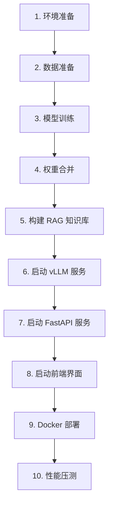

# 📖 LegalFlash-RAG 完整使用手册

> **傻瓜式教程**：从零开始，一步步带你完成模型训练、部署和压测

---

## 📋 目录

1. [环境准备](#1-环境准备)
2. [数据准备](#2-数据准备)
3. [模型训练](#3-模型训练)
4. [权重合并](#4-权重合并)
5. [构建 RAG 知识库](#5-构建-rag-知识库)
6. [启动推理服务](#6-启动推理服务)
7. [启动 API 服务](#7-启动-api-服务)
8. [启动前端界面](#8-启动前端界面)
9. [Docker 部署](#9-docker-部署)
10. [性能压测](#10-性能压测)

---

## 1. 环境准备

### 1.1 安装依赖

```bash
# 进入项目目录
cd /root/autodl-tmp/flash-rag

# 安装所有依赖（推荐使用国内镜像）
pip install -i https://pypi.tuna.tsinghua.edu.cn/simple -r requirements.txt

# 如果遇到 bitsandbytes 安装问题，单独安装
pip install -i https://pypi.tuna.tsinghua.edu.cn/simple --trusted-host pypi.tuna.tsinghua.edu.cn bitsandbytes
```

### 1.2 验证安装

```bash
# 检查核心依赖
python -c "import torch; import transformers; import vllm; print('✅ 核心依赖安装成功')"
```

### 1.3 准备数据文件

确保你有以下 DISC-Law 数据集文件（放在项目根目录或 `data/` 目录下）：
- `DISC-Law-SFT-Pair-QA-released.jsonl` - 用于训练
- `DISC-Law-SFT-Triplet-QA-released.jsonl` - 用于构建 RAG 知识库
- `DISC-Law-SFT-Triplet-released.jsonl` - 用于构建 RAG 知识库
- `DISC-Law-SFT-Pair.jsonl` - 用于构建 RAG 知识库

---

## 2. 数据准备

### 2.1 转换和划分训练数据集

**步骤 1：准备训练数据**

```bash
# 将 DISC-Law 格式转换为项目格式，并划分训练集/验证集/测试集
python scripts/prepare_dataset.py DISC-Law-SFT-Pair-QA-released.jsonl \
    --train-ratio 0.8 \
    --val-ratio 0.1 \
    --test-ratio 0.1
```

**输出文件：**
- `data/datasets/train.jsonl` - 训练集（80%）
- `data/datasets/val.jsonl` - 验证集（10%）
- `data/datasets/test.jsonl` - 测试集（10%）

**如果已有划分好的数据集，可以直接使用：**

```bash
# 使用现有文件，跳过转换
python scripts/prepare_dataset.py --use-existing
```

### 2.2 验证数据集格式

```bash
# 验证数据集格式是否正确
python scripts/prepare_dataset.py --validate
```

### 2.3 分析数据集（可选）

```bash
# 分析数据集统计信息
python scripts/analyze_dataset.py data/datasets/train.jsonl
```

---

## 3. 模型训练

### 3.1 检查训练配置

编辑 `config/train_config.yaml`，确认以下关键参数：

```yaml
model:
  name: "hfl/llama-3-chinese-8b-instruct-v3"  # 基础模型
  max_seq_length: 2048  # 根据显存调整

quantization:
  load_in_4bit: true  # 启用 4-bit 量化（节省显存）

training:
  num_train_epochs: 3  # 训练轮数
  per_device_train_batch_size: 8  # 批次大小（根据显存调整）
```

### 3.2 开始训练

```bash
# 启动训练（单 GPU）
python train.py

# 如果使用多 GPU，可以使用 accelerate
accelerate launch train.py
```

**训练过程：**
- 训练日志会输出到控制台
- TensorBoard 日志保存在 `output/logs/`
- 训练检查点保存在 `output/checkpoint-*/`
- GPU 监控数据会记录到 TensorBoard

### 3.3 查看训练进度（可选）

**打开新终端，启动 TensorBoard：**

```bash
bash scripts/view_training.sh
# 或手动启动
tensorboard --logdir output/logs --port 6006
```

然后在浏览器打开 `http://localhost:6006` 查看：
- 损失曲线
- 学习率变化
- GPU 使用率
- 训练速度

### 3.4 训练完成检查

训练完成后，检查输出目录：

```bash
ls -lh output/
# 应该看到类似：
# - checkpoint-1/
# - checkpoint-2/
# - checkpoint-3/
# - logs/
```

---

## 4. 权重合并

**⚠️ 重要：训练完成后必须合并权重，否则 vLLM 无法使用！**

### 4.1 合并 LoRA 权重到基础模型

```bash
# 合并权重（使用最新的检查点）
python merge.py

# 或者指定检查点路径
python merge.py --checkpoint output/checkpoint-3
```

**输出：**
- 合并后的模型保存在 `output/llama3-law-merged/`
- 包含完整的模型权重（`.safetensors` 文件）

### 4.2 验证合并结果

```bash
# 检查合并后的模型文件
ls -lh output/llama3-law-merged/
# 应该看到：
# - config.json
# - model.safetensors (或 model-*.safetensors)
# - tokenizer.json
# - ...
```

---

## 5. 构建 RAG 知识库

### 5.1 提取知识库内容

**步骤 1：提取法条型知识库（从 reference 字段）**

```bash
python scripts/prepare_rag_knowledge.py \
    DISC-Law-SFT-Triplet-QA-released.jsonl \
    --mode law \
    --output data/docs/legal_docs.txt
```

**步骤 2：提取案例型知识库（从 input + output）**

```bash
python scripts/prepare_rag_knowledge.py \
    DISC-Law-SFT-Triplet-QA-released.jsonl \
    --mode case \
    --output data/docs/case_docs.txt
```

**步骤 3：提取判决书型知识库（从 input 字段）**

```bash
python scripts/prepare_rag_knowledge.py \
    DISC-Law-SFT-Pair.jsonl \
    --mode judgement \
    --output data/docs/judgement_docs.txt
```

### 5.2 构建向量数据库

**步骤 1：构建法条型向量数据库**

```bash
python ingest.py \
    --docs_path data/docs/legal_docs.txt \
    --knowledge_type law \
    --chunk_size 500 \
    --chunk_overlap 50
```

**步骤 2：构建案例型向量数据库**

```bash
python ingest.py \
    --docs_path data/docs/case_docs.txt \
    --knowledge_type case \
    --chunk_size 1000 \
    --chunk_overlap 100
```

**步骤 3：构建判决书型向量数据库**

```bash
python ingest.py \
    --docs_path data/docs/judgement_docs.txt \
    --knowledge_type judgement \
    --chunk_size 2000 \
    --chunk_overlap 200
```

**输出：**
- `chroma_db/` - 法条型向量数据库
- `chroma_db_case/` - 案例型向量数据库
- `chroma_db_judgement/` - 判决书型向量数据库

---

## 6. 启动推理服务

### 6.1 启动 vLLM 服务

**打开终端 1：**

```bash
# 启动 vLLM 推理服务
bash scripts/vllm.sh
```

**等待输出：**
```
INFO:     Started server process
INFO:     Uvicorn running on http://0.0.0.0:8000
```

**如果遇到 OOM 错误，编辑 `scripts/vllm.sh`，降低显存使用：**
- 减小 `--gpu-memory-utilization`（如 0.8）
- 减小 `--max-num-seqs`（如 64）

### 6.2 验证 vLLM 服务

**打开新终端，检查服务状态：**

```bash
bash scripts/check_vllm.sh
# 或手动检查
curl http://localhost:8000/health
```

---

## 7. 启动 API 服务

### 7.1 启动 FastAPI 服务

**打开终端 2：**

```bash
# 启动 FastAPI RAG 服务
bash scripts/fastapi.sh
```

**等待输出：**
```
INFO:     Started server process
INFO:     Uvicorn running on http://0.0.0.0:8080
```

### 7.2 验证 API 服务

```bash
# 检查健康状态
curl http://localhost:8080/health

# 查看监控指标
curl http://localhost:8080/metrics | jq
```

### 7.3 测试 API（可选）

```bash
# 测试聊天接口
curl -X POST http://localhost:8080/api/rag/chat \
    -H "Content-Type: application/json" \
    -d '{
        "query": "什么是合同违约？",
        "temperature": 0.1,
        "max_tokens": 512,
        "stream": false
    }'
```

---

## 8. 启动前端界面

### 8.1 启动 Streamlit 前端

**打开终端 3：**

```bash
# 启动 Streamlit 前端
bash scripts/frontend.sh
```

**等待输出：**
```
You can now view your Streamlit app in your browser.
Local URL: http://localhost:8501
```

### 8.2 访问前端

在浏览器打开 `http://localhost:8501`，你可以：
- 输入法律问题
- 查看实时流式输出
- 查看 RAG 检索来源
- 调整温度、最大 token 数等参数

---

## 9. Docker 部署

### 9.1 安装 Docker（如果未安装）

**在 Autodl 实例中：**

```bash
# 安装 Docker
curl -fsSL https://get.docker.com | sh

# 安装 NVIDIA Docker（GPU 支持）
distribution=$(. /etc/os-release;echo $ID$VERSION_ID)
curl -s -L https://nvidia.github.io/nvidia-docker/gpgkey | sudo apt-key add -
curl -s -L https://nvidia.github.io/nvidia-docker/$distribution/nvidia-docker.list | \
    sudo tee /etc/apt/sources.list.d/nvidia-docker.list
sudo apt-get update
sudo apt-get install -y nvidia-docker2
sudo systemctl restart docker

# 验证 GPU 支持
docker run --rm --gpus all nvidia/cuda:12.1.0-base-ubuntu22.04 nvidia-smi
```

### 9.2 准备模型和配置

**确保以下文件/目录存在：**
- `output/llama3-law-merged/` - 合并后的模型
- `chroma_db/` - 向量数据库（至少一个）
- `config/` - 配置文件

### 9.3 启动 Docker 服务

```bash
# 一键启动所有服务
bash scripts/docker-start.sh

# 或手动启动
docker-compose up -d --build
```

**等待服务启动（约 1-2 分钟）：**

```bash
# 查看服务状态
docker-compose ps

# 查看日志
docker-compose logs -f
```

### 9.4 验证 Docker 部署

```bash
# 检查容器健康状态
docker inspect legalflash-rag-vllm | grep -A 10 Health
docker inspect legalflash-rag-app | grep -A 10 Health

# 检查服务端点
curl http://localhost:8000/health  # vLLM
curl http://localhost:8080/health  # FastAPI
```

**访问服务：**
- vLLM API: `http://localhost:8000`
- FastAPI: `http://localhost:8080`
- Streamlit: `http://localhost:8501`

### 9.5 停止 Docker 服务

```bash
# 停止所有服务
bash scripts/docker-stop.sh

# 或手动停止
docker-compose down
```

---

## 10. 性能压测

### 10.1 安装 Locust（如果未安装）

```bash
pip install locust
```

### 10.2 运行压测

**方式 1：使用脚本（推荐）**

```bash
# 使用默认配置运行压测
bash scripts/run_load_test.sh

# 自定义参数
HOST=http://localhost:8080 \
USERS=50 \
SPAWN_RATE=5 \
DURATION=5m \
bash scripts/run_load_test.sh
```

**方式 2：使用 Locust Web UI**

```bash
# 启动 Locust Web UI
locust -f tests/locustfile.py --host=http://localhost:8080

# 然后在浏览器打开 http://localhost:8089
# 设置并发用户数、增长速率等参数，点击 "Start" 开始压测
```

**方式 3：无头模式（命令行）**

```bash
locust -f tests/locustfile.py \
    --host=http://localhost:8080 \
    --users=50 \
    --spawn-rate=5 \
    --run-time=5m \
    --headless \
    --html=reports/locust_report.html \
    --csv=reports/locust_stats
```

### 10.3 查看压测报告

```bash
# HTML 报告
open reports/locust_report.html

# CSV 统计
cat reports/locust_stats_stats.csv
```

**关键指标：**
- **RPS (Requests Per Second)**: 每秒请求数
- **响应时间**: 平均延迟、P50/P95/P99 延迟
- **错误率**: 失败请求百分比

### 10.4 监控系统指标

**在压测过程中，实时查看监控指标：**

```bash
# 查看完整监控指标
curl http://localhost:8080/metrics | jq

# 查看 GPU 使用情况
watch -n 1 'curl -s http://localhost:8080/metrics | jq ".gpu"'
```

---

## 📊 完整流程总结



---

## ⚠️ 常见问题

### Q1: 训练时显存不足？

**解决方案：**
1. 在 `config/train_config.yaml` 中启用 4-bit 量化：`load_in_4bit: true`
2. 减小批次大小：`per_device_train_batch_size: 4`
3. 增加梯度累积：`gradient_accumulation_steps: 2`

### Q2: vLLM 启动失败，提示 OOM？

**解决方案：**
1. 编辑 `scripts/vllm.sh`，降低 `--gpu-memory-utilization`（如 0.8）
2. 减小 `--max-num-seqs`（如 64）
3. 减小 `--max-model-len`（如 2048）

### Q3: Docker 容器无法访问 GPU？

**解决方案：**
1. 确保安装了 NVIDIA Docker：`nvidia-docker2`
2. 验证 GPU 支持：`docker run --rm --gpus all nvidia/cuda:12.1.0-base-ubuntu22.04 nvidia-smi`
3. 检查 `docker-compose.yml` 中的 GPU 配置

### Q4: 压测时响应时间过长？

**解决方案：**
1. 检查 GPU 使用率：`curl http://localhost:8080/metrics | jq ".gpu"`
2. 如果 GPU 利用率低，增加 `--max-num-seqs`
3. 如果 GPU 利用率高，考虑增加 GPU 数量或优化模型

---

## 📝 快速命令速查

```bash
# 数据准备
python scripts/prepare_dataset.py <input_file>

# 训练
python train.py

# 权重合并
python merge.py

# 构建知识库
python ingest.py --docs_path <file> --knowledge_type <type>

# 启动服务
bash scripts/vllm.sh        # 终端 1
bash scripts/fastapi.sh      # 终端 2
bash scripts/frontend.sh     # 终端 3

# Docker 部署
bash scripts/docker-start.sh
bash scripts/docker-stop.sh

# 压测
bash scripts/run_load_test.sh
```

---

## 🎉 完成！

恭喜！你已经完成了从模型训练到生产部署的完整流程。

**下一步：**
- 根据业务需求调整模型参数
- 优化 RAG 检索策略
- 添加更多监控指标
- 扩展知识库内容

**需要帮助？**
- 查看 `README.md` 获取更多信息
- 查看 `docs/` 目录下的详细文档
- 检查 `config/train_config.yaml` 中的配置说明

